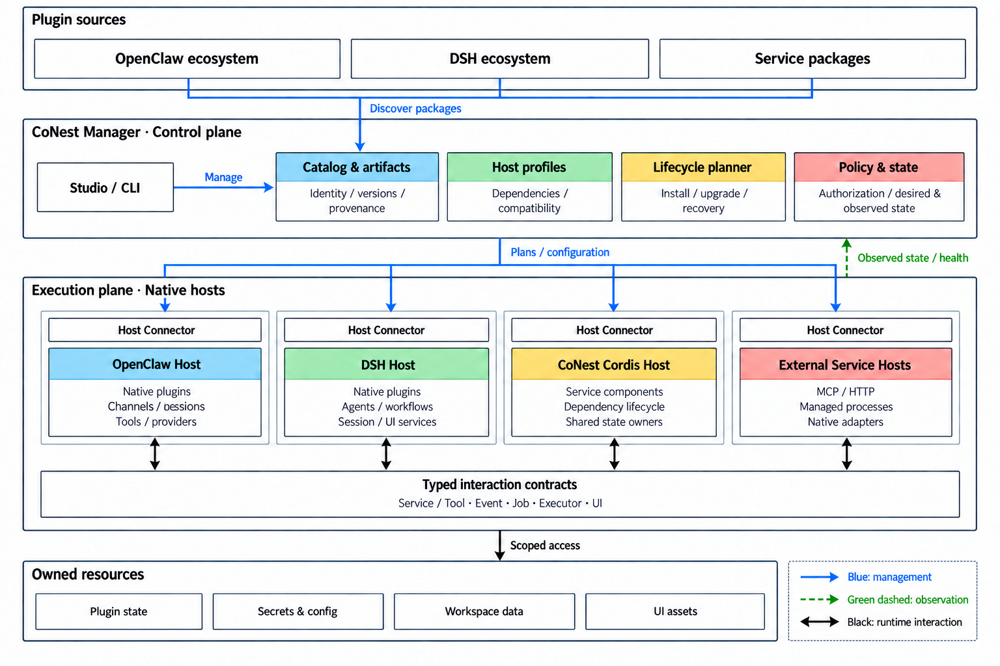

# CoNest 插件生态平台架构

初稿：2026-09-06 · 本次修订：2026-09-17

范围：OpenClaw 与 DSH 完整插件生态的接入、运行和治理。

状态：面向 `develop` 的目标架构；第二节记录已实现基线，其余章节规定后续建设。运行时、进程与接口的新设计尚未实现，不改变 `main` 或既有安装包的能力声明。

**CoNest 的定位是跨生态插件平台：统一发现、安装、组合和治理插件，让插件在能够满足其真实依赖的宿主环境中运行，并通过明确契约参与其他生态的工作流。** 工具与 Agent Loop 是插件贡献的一部分；模型、记忆、会话、事件、工作流、后台服务、界面和完整应用同样属于架构范围。

目标采用“统一生态控制面、可组合宿主环境、多运行时执行面”。统一的是身份、描述、安装计划、授权和生命周期记录；插件的原生执行语义由对应宿主保留。界面能展示一个插件、平台能安装它、插件能原生运行、其他宿主能调用其能力，分别记录和验收。

## 一、设计目标与核心决策

平台面向三类用户：使用者能找到插件、理解依赖并完成配置；插件作者能保留原生态包，通过声明贡献和依赖进入平台；维护者能判断升级影响、定位故障并恢复已知可用配置。

本版确定以下架构决策，作为后续代码归属的依据：

1. **以完整插件包为接入对象。** 一个包可以同时贡献后端服务、工具、hooks、界面、命令和数据迁移，不能将其拆成若干工具后就宣称完成兼容。
2. **采用宿主画像匹配插件。** 画像声明宿主实际提供的服务、版本、事件、会话、UI 和平台条件。依赖解析先选运行环境，再决定哪些贡献可以跨宿主提供。
3. **保留多个原生运行时。** OpenClaw 原生插件由 OpenClaw 管理，依赖完整 DSH 语义的插件由原生 DSH 环境管理，可独立承载的 Cordis 组件由 CoNest Runtime 管理。平台不重新实现整个 OpenClaw 或 DSH。
4. **管理与执行分离。** 独立 CoNest Manager 保存目标状态和操作记录，各宿主 Connector 执行本域受支持的管理操作；组件代码不装载到 Manager。
5. **先按状态和生命周期组织组件，再决定进程分组。** 同一文件的读取观察与编辑校验、同一会话的 Agent 与 Session、同一记忆文件的写入队列，均有唯一明确的状态所有者。
6. **为不同贡献提供不同契约。** 一次工具调用、长期订阅、后台作业、推理回合和界面扩展分别建模，不强行共用一个无限扩张的 `invoke` 接口。

本轮优先建设单机平台。远程执行节点、更多宿主、组织级发布流程可以沿用这些边界扩展；分布式调度集群、自动生成插件和自主发布不是本轮交付前提。

## 二、当前实现与目标差距

核对基线为 `develop` 的 0.6.3 源码，修订前提交 `6d52d93`。当前固定依赖为 OpenClaw 2026.9.2 和 DSH 0.1.0-rc.5；Linux x64 是本地开发验证基线。旧设计中的“尚无独立扩展进程”和“仍为 0.0.1 快照”已不适用。

| 领域 | 已实现 | 本方案需要补齐 |
|---|---|---|
| 插件发现 | Studio 合并 OpenClaw 目录与 DSH Market 元数据 | 包身份、真实依赖、贡献类型、来源验证和逐版本兼容证据 |
| 组件管理 | Cordis Loader、依赖就绪、版本化调用、配置变更及停用/卸载 | 从服务组件扩展到完整插件安装计划和跨宿主状态协调 |
| 进程与通信 | 受监督的常驻组件 worker；私有 stdio NDJSON RPC | 独立 Manager、宿主 Connector、事件/作业/执行器等不同契约 |
| DSH 能力 | 搜索、读取、记忆已纳入 worker；固定 DSH 组合仍在 Gateway | 以宿主画像装配依赖，将固定组合转换为受管理的 DSH 运行环境 |
| 执行器 | 两种 Loop 可使用宿主获准工具；DSH Agent/Session 在 Gateway 内 | 完整执行器生命周期、模型通道和宿主回调的进程外适配 |
| 界面 | Studio；DSH Web companion 嵌入同一 Studio | 插件界面贡献、后端绑定、原生 UI 入口及版本一致性 |
| 数据与权限 | 组件调用授权、记忆读写拆分、会话生命周期绑定 | 后台事件、定时作业、UI 操作、插件间调用的明确主体与权限契约 |

现有 worker、Loader、授权和行为测试保留为基础。当前的组件清单与 `capabilities` 描述是第一种贡献模型，不作为完整生态插件模型的上限。

## 三、目标架构与部署

图 1：目标逻辑架构。蓝色控制面管理插件与运行环境；各原生宿主并列运行。图中的统一交互契约表示按类型接入，不表示所有调用必须经过 Manager。Studio/CLI 在逻辑上属于管理入口，并不装载到 Manager 服务进程。具体部署与调用路径以下表和第五节为准。

| 构成 | 负责什么 | 部署与生命周期 |
|---|---|---|
| **CoNest Studio / CLI** | 发现插件、配置、预览变更、查看依赖与诊断、进入原生界面 | Studio 是管理客户端；CLI 复用相同管理 API。UI 不直接持有执行权限或管理凭据 |
| **CoNest Manager** | 包目录、宿主画像、兼容解析、安装/升级计划、策略、制品与操作记录 | 单机独立常驻服务，单写者维护平台状态；不运行第三方插件代码 |
| **Host Connectors** | 发现宿主状态、映射身份与贡献、请求管理操作、转发运行事件 | OpenClaw/DSH 各有适配器，使用公开接口；不具备接口的操作标记只读或维护时执行 |
| **OpenClaw Host** | 原生渠道、会话、插件、工具、模型与消息交付 | 原生生命周期继续由 OpenClaw 管理；已有用户 Gateway 可接入，平台不擅自接管启停 |
| **DSH Host** | 需要 DSH Agent/Session、hooks、工作流或客户端环境的原生插件 | 平台创建或连接固定版本的 DSH 实例，以画像装配真实服务；前端与后端按原生要求部署 |
| **CoNest Cordis Host** | 可独立运行的服务组件、组合服务、适配后可跨宿主提供的贡献 | 从现有组件 worker 演进；按工作区、信任域和依赖兼容性组织进程组 |
| **External Service Hosts** | MCP、HTTP 服务及插件声明的辅助程序 | 复用已有原生管理器，或由专用执行适配器管理；同一实例只有一个启停所有者 |

Manager 管理两类状态：用户要求的目标版本、配置与授权，以及 Connector 报告的实际实例、加载结果与健康状态。两者不一致时展示原因并执行可恢复的操作计划。普通能力调用和插件内部依赖调用走执行面，不经过目录查询、计划器等全部控制模块。

首个完整部署采用“一个 Manager + 已有 OpenClaw Gateway + CoNest 组件进程组 + 按需启用的 DSH 宿主”。不按每次调用启动 DSH，也不为每个包强制创建进程。需要相同原生服务和共享状态的受信任插件可以同组；版本冲突、凭据范围或信任域不同则分组。进程崩溃、重启和资源回收以组为单位展示影响。

DSH 的 Gateway 内固定 composition 最终退出宿主适配层：独立服务进入 Cordis Host，原生执行器及其会话组合进入 DSH Host。迁移后 OpenClaw 只保留 DSH harness 的宿主注册和回调适配，原生 OpenClaw Loop 不移动。

## 四、完整插件模型与兼容机制

### 4.1 一个插件可以有多种贡献

平台在原始包旁保存 CoNest 描述，不重写原生态清单、不要求所有作者迁移打包体系。原包、依赖锁和许可证保持可追溯；平台适配代码单独标识版本。描述由作者或维护者补充，自动扫描结果作为候选信息，运行前必须核验。

| 描述对象 | 必需内容 | 用途 |
|---|---|---|
| 包与来源 | 生态、包名、发布者声明、来源、版本、内容摘要、许可证 | 区分同名包、固定制品；签名状态与摘要校验分别记录 |
| 运行要求 | 宿主版本、服务及版本、OS/CPU、原生库、客户端环境 | 解析完整依赖闭包与运行位置 |
| 贡献清单 | 工具、服务、模型、记忆、hooks、工作流、渠道、命令、UI、执行器等 | 每项贡献声明原生注册点、输入输出或事件语义、作用域与暴露方式 |
| 状态与资源 | 配置、秘密引用、持久状态格式、存储所有者、端口、后台任务、迁移步骤 | 安装规划、唯一所有权、升级与卸载 |
| 授权与生命周期 | 权限需求、订阅、激活条件、释放动作、重载要求 | 准入判断、撤权与排空 |
| 兼容证据 | 原包/适配器/宿主/平台版本组合、验收场景、限制 | 区分声明可用与实际验证可用 |

依赖图同时包含包依赖、运行时服务依赖和前后端绑定。一个 npm 包安装成功，不意味着它依赖的 Session、UI 插槽或事件服务已经存在。循环服务依赖、互斥资源和单实例状态在激活前检查，缺项给出具体依赖链。

### 4.2 三条执行路线

| 路线 | 适用对象 | 平台提供的价值 |
|---|---|---|
| **原生托管** | OpenClaw 原生插件；依赖完整 DSH 运行环境的插件 | 在原宿主运行，统一安装计划、配置入口、状态和升级记录；保留原生语义 |
| **画像承载** | 依赖可以由确定的 DSH/Cordis 服务组合满足的插件 | 将已验证的服务组合固定为 Host Profile，在 CoNest 管理的运行环境中复用原插件 |
| **贡献适配** | 需要被其他宿主使用的工具、服务、事件、视图等 | 对选定贡献建立版本化适配，不把部分适配标成整个插件跨宿主兼容 |

三条路线可以组合：一个 DSH 插件在原生 DSH Host 中运行，其检索接口可供 OpenClaw 调用，原生 UI 仍由 DSH 客户端显示。不能跨宿主的内部 hooks 可以继续在原环境工作，不必因此重写整个插件。

Host Profile 是锁定的装配清单，包含宿主、服务图、客户端要求、权限上限、平台资产和验证记录。优先沉淀独立服务、会话与 Agent、工作流/后台作业、Web 客户端等组合；画像之间按依赖关系组合，不建立万能模拟宿主。缺失真实 Agent、Session 或 UI 语义时，不用伪造对象使插件看起来已激活。

兼容结果至少同时记录“包已安装、宿主依赖已就绪、各贡献已激活、跨宿主适配范围、调用者已授权、已验证平台”。插件可原生运行而部分跨宿主贡献不可用；可选贡献缺失仅按清单声明降级，必需贡献缺失则阻止相应功能启用。

### 4.3 生态覆盖矩阵

| 插件类别 | 必须承接的宿主语义 | 接入与验收重点 |
|---|---|---|
| 工具、文件、搜索、外部 API | 参数、结果、工作区、取消、工具事件 | 原生执行与跨宿主适配均验证；读写副作用遵循真实服务语义 |
| 模型、推理、中间件 | 路由、流式内容、鉴权、重试、用量 | 原生 provider 和拦截链保留；模型不统一成普通文本 RPC |
| 记忆、知识、数据库、持久化 | 数据归属、索引、读写事务、迁移 | 配置一个明确后端，跨宿主访问走服务契约，不复制出隐含第二份数据 |
| Agent、Loop、Session、上下文 | 历史、上下文组装、生命周期、推理事件 | 原生 Host Profile；宿主身份与原生会话明确映射，跨宿主历史转换单独声明 |
| Skill、Plan、Todo、工作流 | 指令生效范围、真实会话、审批、任务状态 | 保留原生工作流，读取描述不等于支持执行；长流程使用作业契约 |
| hooks、事件、定时器、后台服务 | 事件顺序、订阅作用域、投递规则、停用释放 | 每条映射声明过滤、顺序和重放语义；撤权后后台入口同样失效 |
| 渠道、消息、通知、命令 | 账户身份、路由、投递与幂等 | 由原宿主管理连接；跨宿主转发保留来源，避免重复投递和回环 |
| UI、设置页、交互卡片、完整应用 | 前端运行时、插槽、资源、后端接口与用户身份 | 优先保留原生 UI；可适配界面挂入 Studio，前后端作为同一发布计划 |
| 沙箱、执行环境、原生扩展 | OS、原生二进制、资源约束、进程清理 | 匹配平台资产与执行策略；不能只凭 JavaScript 加载成功判定兼容 |

“面向整个生态”意味着所有这些类别都有接入模型、运行路线和明确的失败状态。每个具体插件的可用范围仍由固定版本的依赖解析与验收结果决定，首版不承诺任意生态包零适配运行。

### 4.4 插件作者与维护者的接入流程

作者继续使用原生 OpenClaw 或 DSH 开发方式。CoNest 提供描述生成、画像解析、贡献适配接口和兼容测试套件；能够原生托管的插件不要求改写。维护者补充的描述与适配器作为独立制品发布，锁定原包摘要，明确适配维护责任。

接入流程为“识别原包 → 声明完整贡献与资源 → 解析目标画像 → 在隔离工作区运行 → 验证贡献与生命周期 → 发布兼容记录”。验证器覆盖安装、使用、取消、停用、升级和卸载，而不仅验证清单格式。插件变更、画像变更或适配器变更分别触发受影响用例，兼容记录不能自动跨版本继承。

一个目标示例是同时包含笔记编辑界面、索引服务、文件变更订阅和后台同步的知识插件：平台需要一起安装前后端、绑定存储、启用订阅、管理同步作业，并允许 OpenClaw 调用其中的检索服务。只有检索工具可用时，状态应显示“检索贡献已适配”，不能显示“完整插件已兼容”。

## 五、统一交互与运行路径

统一交互层使用同一身份、关联标识和错误分类，但保留不同交互模型。以下是拟建设的语义接口族，不是现有 RPC 已支持的方法列表。

| 接口族 | 语义 | 关键规则 |
|---|---|---|
| Service / Tool | 查询、一次调用、流式结果、取消 | 有界请求；标识真实提供者；状态不明的写入不自动重试 |
| Event | 订阅、通知、解除订阅 | 订阅绑定身份和生命周期；按源声明顺序与投递方式，重放必须显式支持 |
| Job / Workflow | 提交、进度、暂停/继续、取消、查询 | 只暴露原生执行器实际支持的操作；后台运行有持久作业身份 |
| Executor | 创建/绑定会话、执行回合、工具回调、审批、终止 | 宿主会话与原生 Session 分别归属；结束后回调资格失效 |
| UI / Interaction | 注册视图、绑定后端、提交操作、交互应答 | 浏览器只取得用户授权的接口，不取得 Manager 管理密钥 |
| Management | 计划、安装、配置、启停、升级、卸载、观察状态 | 修改请求带预期修订；宿主真实管理器决定可执行操作 |

同组 Cordis 服务继续使用原生依赖注入和事件机制；只有跨宿主、跨进程或平台管理边界需要显式协议。现有私有 stdio NDJSON RPC 可以作为本机服务调用传输基础，扩展时进行协议版本协商；原生 MCP 连接继续使用 MCP，浏览器使用经认证的 HTTP/流式接口。协议编码不决定插件的运行语义。

**安装一个完整 DSH 插件：** Studio 选择包 → Manager 解析后端、UI、状态和宿主依赖 → 生成可审阅的安装计划 → 对匹配的 DSH Host 装配服务并激活原插件 → 验证各项贡献 → 发布可用状态和相应跨宿主入口。原生 UI 不能适配时提供已认证的原宿主入口，明确界面所在位置。

**OpenClaw 调用生态能力：** 原生工具/hooks/插件入口 → Connector 获取该入口真实身份与授权 → 路由到已就绪的贡献提供者 → 返回原生结果或明示的适配结果。普通服务调用不启动另一 Agent Loop。

**DSH 执行一个回合：** OpenClaw 通过公开 harness 接口建立运行 → DSH Connector 绑定真实 Session 与 Agent → 原生 DSH Loop 执行。需要 OpenClaw 工具时回调其真实 tool executor；使用 CoNest 服务时遵守同一宿主授权与服务端权限交集，不能借原生本地工具绕过宿主拒绝。任务中的普通 hooks 和自动记忆只执行一次。模型 provider 默认由所选画像中的原生宿主执行；若复用另一宿主的模型通道，必须声明流式、鉴权、取消和用量适配，不能静默切换 provider 或复制整份宿主凭据。

**后台或界面发起操作：** 使用独立的服务主体、作业身份或当前用户身份，不伪装成 Agent 回合，也不默认使用 operator 全权限。跨插件事件触发后续调用时，保留触发来源和授权链。

跨宿主请求携带宿主实例、调用主体、工作区、插件实例/版本、会话生命周期或作业身份、调用关联与截止时间。凭据不来自模型参数；受信任身份绑定由 Connector 建立，服务端校验授权范围和撤销状态。记录原始提供者与传播路径，避免工具重复导出、事件回流和渠道转发循环。

## 六、状态、权限与界面边界

| 状态 | 唯一所有者 | 跨边界使用方式 |
|---|---|---|
| 原始制品与来源 | Manager 的只读制品库 | 内容摘要寻址，实例引用；不直接改已安装包 |
| 目标配置与操作记录 | Manager；原宿主配置仍由原宿主负责落地 | Connector 回报实际修订；外部人工变更形成冲突，不反复覆盖 |
| 用户身份、宿主会话与可见历史 | 对应 OpenClaw / DSH 原生宿主 | 显式映射会话及生命周期；共享记忆不等于合并聊天历史 |
| Agent/Loop 内部状态 | 所选原生执行器 | 服务复用无需运行该 Loop；复用会话需满足原生生命周期规则 |
| 文件观察与编辑保护 | 同一工作区文件服务中的会话隔离上下文 | DSH 的读、写、编辑共同绑定原生观察策略；任意其他工具的读结果不会自动获得编辑资格 |
| 记忆与插件持久状态 | 对应服务或原生插件声明的存储所有者 | 跨宿主通过 API 访问；迁移、备份、保留与删除分别管理 |
| 模型连接与秘密 | 获授权的 provider 所在宿主及其秘密配置 | 只给实际执行 provider 的实例配置所需引用；复用宿主模型通道需要明确适配 |
| UI 状态与静态资源 | 插件前端实例，发布版本与后端绑定 | 私有数据经授权 API 获取；仅共享明确允许的视图状态 |

受管理的 DSH 文件读取与编辑应归入同一文件服务，保留原生 DSH 参数语义和观察校验。与真实会话有关的原生上下文由画像适配建立；若服务依赖要求它留在 DSH Host，就将这组服务整体托管于该 Host。禁止为减少进程跳转而复制观察表，也不再让 Gateway 额外维护第二套 DSH 文件执行实现。

权限按资源与贡献扩展到文件写入、网络、进程、订阅、作业、UI 后端和秘密引用。实际准入取宿主限制、安装授权、当前主体与服务端策略的交集。模型可见工具、插件内部服务与管理操作分别有入口，权限判断共享可信身份和规则。

受信任插件可以共享 Cordis 进程与服务；不可信代码需要操作系统身份、文件/网络和资源隔离。单独 Node.js 进程、Cordis Context、声明权限均不等于安全沙箱。无法落实所需隔离时阻止启用，而不是给出虚假的沙箱标识。

UI 贡献分为原生宿主界面和 Studio 适配视图。前者保留原客户端依赖与插槽；后者在受限来源中装载，通过有来源校验、用户绑定和版本校验的桥接访问后端。iframe 展示成功只是嵌入验收，不能代替原生 UI API 兼容性验收。插件脚本不得获得平台管理页面的同源权限。

## 七、安装、升级和故障恢复

安装与升级围绕整个插件发布计划执行：解析依赖与冲突 → 校验制品和平台资产 → 准备状态备份与迁移条件 → 建立候选运行环境 → 验证必需贡献 → 发布新绑定 → 排空并清理旧实例。必须重启的原生宿主进入明确维护流程，不伪装成热升级。

跨宿主升级采用持久操作记录和逐步确认，不承诺全局原子事务。切换前失败可丢弃候选；已经产生外部效果或不可逆数据迁移时进入待核查/恢复状态，不能仅将版本号改回去就报告回滚成功。卸载默认释放入口、订阅、作业和受管进程，保留用户数据；清除数据是单独操作。

版本固定分三种作用域：

- **能力调用：** 保留现有语义，一次已接纳调用及其嵌套服务调用使用同一依赖版本图；后续独立调用可以使用新版本，旧 generation 必须重新发现。
- **执行器会话：** 目标设计固定其原生运行环境与状态格式，直到安全会话边界再切换；新版本不得接管旧会话中的存活对象。当前固定 Gateway composition 不等于已经实现此升级机制。
- **长期订阅与作业：** 绑定创建它的插件实例和作用域；升级时显式选择排空、取消或原生支持的迁移，不能静默把旧事件交给新状态。

Manager 失联时停止新的管理变更与授权扩张；已运行宿主及执行面在既有有效授权内继续工作。身份核验或权限租约失效的请求拒绝执行。Manager 恢复后先核对真实状态，再恢复计划。宿主崩溃只恢复确认可恢复的实例，不自动重放模型回合、外部消息或结果未知的写入。

诊断按插件、宿主画像、实例、修订和调用关联展示。状态至少区分“已发现、已安装、依赖阻塞、已激活、部分可用、降级、维护中、失败”，并单独展示每项贡献的授权和验证范围。事件与日志有容量限制和访问控制，秘密及私有内容不进入公共诊断。

## 八、为什么采用这套架构

| 现有结构的限制 | 本方案的改进 | 需要承担的成本 |
|---|---|---|
| 市场条目与可执行能力之间缺少完整映射 | 包、贡献、宿主画像和兼容证据形成闭环 | 维护描述器、解析器及真实插件测试集 |
| 独立工具适配难以覆盖会话、UI 和工作流插件 | 原生托管保留完整语义，跨宿主只适配明确贡献 | 部分用户需要同时运行原生 DSH 环境 |
| 同一套 DSH 功能分散在 Gateway 与 worker | 按状态所有者合并服务，固定组合移交 DSH Host | 迁移宿主回调、审批、模型与会话绑定 |
| 界面可见容易被误认为已经兼容 | 显示每项贡献和每个环境的真实状态 | Studio 需要依赖诊断和部分可用状态 |
| 包升级、后端变更和 UI 更新各自进行 | 以完整插件计划协调变更与恢复 | 增加 Manager 和持久操作记录，但不引入分布式集群 |

这套方案扩大的是可承接的插件种类、可解释的兼容范围和可管理的生命周期。性能收益必须通过启动时间、调用跳转、事件吞吐和进程资源占用实测，不作为架构图自带的保证。

## 九、迁移计划与验收

建设在 `develop` 分阶段推进，沿用已有 0.6.3 测试和固定依赖；`main` 与 `v0.6.2` 保持各自基线。每阶段交付可运行的闭环，不以接口文件数量作为完成标准。

| 阶段 | 建设内容与现有代码归属 | 完成条件 |
|---|---|---|
| A：完整插件模型 | 从 `studio/catalog.ts`、`types.ts`、`management.ts` 提取包目录、贡献描述、画像与兼容解析；原组件描述作为一种贡献适配 | 同一包的后端、UI、状态和依赖完整呈现；缺失服务、版本冲突和必需/可选贡献有准确结果 |
| B：生态控制面 | 基于现有 CLI、配置与管理流程建立独立 Manager、Connector 和操作记录；复用已有 Loader | 通过现有原生宿主完成至少一项 OpenClaw 插件和一项 DSH 插件的安装/配置/停用/卸载；宿主不支持的操作明确进入维护或只读状态 |
| C：DSH 原生运行环境 | 将 `composition.ts`、Agent/Session、模型及审批适配整理为 DSH Host Profile，保留公开 harness 注册 | 除双 Loop 工具互用外，真实运行至少一项会话/工作流贡献与一项前后端组合插件；取消、审批、会话重置、模型通道均有效 |
| D：贡献与状态统一 | 将文件读写按状态所有者合并；搜索、记忆沿用受管理服务；扩展事件、作业和 UI 契约 | 同一服务无需启动 Loop 即可使用；两个宿主访问同一后端；无重复写入、重复 hooks 或备用绕权入口 |
| E：生态发布闭环 | Studio 展示计划、依赖、兼容与运行状态；固化画像、制品和平台验证 | 从选包到实际使用再到升级/卸载完整通过，含失败恢复、状态迁移、订阅清理和界面版本一致性 |

代表插件测试集必须跨类别选择：工具/服务、模型或上下文、记忆/持久化、会话工作流、事件/后台作业、UI+后端组合、原生平台依赖。每个样本记录原始制品、依赖图、运行位置、适配范围和实际验证，不能将安装的依赖包数当作兼容插件数。

回归覆盖两层：保留检索—引用验证、两种 Loop、共享记忆和授权撤销等已有行为；新增完整插件缺依赖、前后端版本错配、后台撤权、跨宿主事件回环、升级中断、Manager 重启、原生宿主故障和数据迁移失败。先用本地模型 fixture 驱动真实宿主，真实模型与各平台制品另行验证。

下一项工程交付从 A 开始：用现有内置组件和 DSH UI companion 建立完整包描述，再选择需要真实会话与事件语义的原生 DSH 插件检验画像模型。画像必须解释非工具插件，才能进入大规模迁移。

## 十、设计依据与文档关系

本文件是 CoNest 后续建设的总体架构。历史文档保留其版本和阶段事实：

- [组件运行时计划](bridge/RUNTIME-PLAN.md)：Loader、版本图与组件管理的基础实现。
- [0.6.2 交付设计](bridge/docs/conest-design-zh.md)：Studio 固定组合与旧执行路径。
- [双 Loop 组件接入](bridge/docs/dual-loop-component-runtime-zh.md)：宿主工具准入、会话生命周期和受管理能力的衔接。
- [读取组件](bridge/docs/read-component-zh.md)、[记忆组件](bridge/docs/memory-component-zh.md)：当前状态边界及已验证语义。
- [DSH 专项兼容矩阵](bridge/DSH-COMPATIBILITY.md)：特定包与特定服务配置的历史证据，不代表全生态结论。
- [依赖来源](maintenance/DEPENDENCIES-zh.md)：现有固定 SDK 和构建来源；完整 DSH 画像需要另行补齐、锁定和分发所需依赖。
- [历史控制设计](CONTROL-DESIGN-zh.md)：风险与远期治理参考；自动演进不因此进入本轮范围。

图 1 使用内置 image_gen 生成并经文字与连线核对；生成规格与关系说明见 [绘图记录](docs/assets/conest-ecosystem-architecture.prompt.txt)。图示表达目标结构，当前完成状态以第二节和对应验收记录为准。
