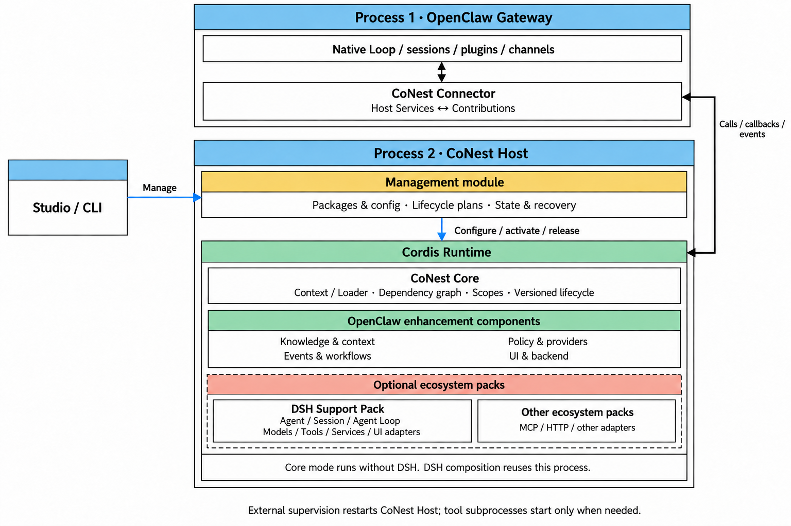

# CoNest：以 Cordis 增强 OpenClaw 的可组合架构

初稿：2026-09-06 · 本次修订：2026-09-17（双进程部署与内嵌 DSH 组合）

范围：OpenClaw 自身的 Cordis 增强，以及建立在该增强层上的完整插件生态接入。

状态：面向 `develop` 的目标架构。第二节记录现有代码基线，其余章节规定后续建设；不改变 `main` 或既有安装包的能力声明。

**CoNest 首先是 OpenClaw 的 Cordis 增强层，其次是依托这个增强层承接外部插件生态的平台。** 即使用户完全不采用 DSH，OpenClaw 仍应获得服务依赖管理、能力组合、上下文扩展、事件协作、状态化服务以及可控更新能力。DSH 的工具、服务、执行器和 UI 是可选接入对象，不是增强内核的启动条件。

目标结构确定为“OpenClaw 基座 + 双向宿主适配 + Cordis 增强内核 + 可选生态包”。**默认部署只有 OpenClaw Gateway 与 CoNest Host 两个常驻应用进程；Management 与 Cordis Runtime 是同一 Host 内部的两个模块。** OpenClaw 继续负责原生会话、渠道、任务入口、授权与交付；Cordis 为这些工作流提供可以声明依赖、组合、替换和释放的服务体系。整个插件生态的覆盖以此为基础展开，不把 CoNest 收缩成 DSH 工具桥，也不把 OpenClaw 降为一个无差别的宿主列表条目。

## 一、目标与核心决策

平台服务两条可以独立交付的主线：**主线 A：增强 OpenClaw；主线 B：扩展生态。** B 使用 A 的能力描述、运行时、生命周期和权限机制；卸载 B 不得破坏 A。

1. **Cordis 增强内核独立成立。** Core 包不依赖 DSH Agent、Session、ToolRuntime、MCP Client 或市场客户端。内核提供 Context、Loader、服务图、作用域、配置、版本和生命周期机制；业务实现由组件注册。
2. **OpenClaw 与增强层双向协作。** Connector 将受支持的宿主服务投影为有授权的接口，供 Cordis 组件组合；再将组件贡献绑定到 OpenClaw 的公开扩展点。绑定范围包括工具、上下文、hooks、服务、命令及受支持的模型、记忆和 UI 接口，不局限于工具表。
3. **原生插件与增强组件分清所有权。** OpenClaw 原生插件仍由原生管理器加载；新建或显式改造的 Cordis 组件由增强内核管理。未改造的任意原生插件不会因此自动获得 Cordis 热替换和依赖注入语义。
4. **完整插件包可以贡献多个部分。** 后端服务、事件、作业、界面、命令和数据迁移共同进入安装与发布计划。通过某个工具接口不能代表整个插件已兼容。
5. **生态兼容通过可选画像与适配包实现。** DSH 服务、原生执行器和客户端依赖分别显式装配；当前已测试的 Agent Loop 与 Tools 以进入 CoNest Host 内的 DSH 组合为迁移目标，不要求额外启动 DSH CLI。增加生态不得向 Core 引入该生态的必需依赖。
6. **先明确状态所有者，再分配进程。** 同一文件的读取观察与编辑校验、同一会话的 Agent 与 Session、同一存储的写入队列按一致性要求组织；组件数量不等于进程数量。
7. **管理与运行分模块，默认不分进程。** Management 通过明确的内部接口配置 Runtime，位于可重建的插件 Context 之外；普通能力调用不经过管理模块。只有多 Runtime 管理或管理面独立可用的明确需求，才采用独立 Manager 部署。

本轮优先建设单机平台。更多生态和远程执行可以沿用这些边界扩展；分布式调度集群、自动生成插件和自主发布不属于本轮前提。

## 二、当前实现与目标差距

核对基线为 `develop` 的 0.6.3 源码，修订前提交 `6d52d93`。当前固定依赖为 OpenClaw 2026.9.2 和 DSH 0.1.0-rc.5；Linux x64 是本地开发验证基线。旧设计中的“尚无独立扩展进程”和“仍为 0.0.1 快照”已不适用。

| 领域 | 已实现 | 本方案需要补齐 |
|---|---|---|
| OpenClaw 增强 | 已有依赖服务组合、动态能力发现、公开 hooks 与上下文适配，以及受管 worker | 抽离不依赖 DSH 的 Core，并扩展可组合的宿主贡献模型 |
| 插件发现 | Studio 合并 OpenClaw 目录与 DSH Market 元数据 | 包身份、真实依赖、贡献类型、来源验证和逐版本兼容证据 |
| 组件管理 | Cordis Loader、依赖就绪、版本化调用、配置变更及停用/卸载 | 从服务组件扩展到完整插件安装计划和跨宿主状态协调 |
| 进程与通信 | 受监督的常驻组件 worker；私有 stdio NDJSON RPC | 将 worker 演进为内含 Management 与 Runtime 的 CoNest Host，补齐 Connector 和事件/作业/执行器契约 |
| DSH 能力 | 搜索、读取、记忆已纳入 worker；固定 DSH 组合仍在 Gateway | 将固定组合与受管 DSH 服务统一纳入 Host 内的可选 Support Pack，按服务画像装配 |
| 执行器 | 两种 Loop 可使用宿主获准工具；DSH Agent/Session 在 Gateway 内 | 完整执行器生命周期、模型通道和宿主回调的进程外适配 |
| 界面 | Studio；DSH Web companion 嵌入同一 Studio | 插件界面贡献、后端绑定、原生 UI 入口及版本一致性 |
| 数据与权限 | 组件调用授权、记忆读写拆分、会话生命周期绑定 | 后台事件、定时作业、UI 操作、插件间调用的明确主体与权限契约 |

现有 worker、Loader、授权和行为测试保留为基础。当前 `components.ts` 同时承担通用注册和 DSH 服务装配，`loader-runtime.ts` 依赖该模块；默认组件与构建依赖也包含 DSH。因此，关闭 Studio 或不选 DSH Loop，尚不能证明存在独立的无 DSH 增强模式。Core 的模块依赖和打包依赖必须一起拆开。

当前 Agent Loop 通过 Cordis 加载在 Gateway 中，Agent/Session 实例不是操作系统进程；组件 worker 是 CoNest 的常驻 Node 进程，不是完整 DSH CLI。Bash、stdio MCP 等能力可以按自身需要创建子进程。目标双进程结构需要迁移现有组合与回调接口，尚未由此次文档修订完成。

当前 `capabilities` 描述是第一种贡献模型，不作为增强组件或完整生态插件模型的上限。

## 三、Cordis 怎样增强 OpenClaw

图 1：默认双进程目标结构。Management 与 Cordis Runtime 同属 CoNest Host；DSH 组合位于 Runtime 内的可选生态包中。Connector 与 Runtime 直接交换调用、回调和事件，管理箭头只表示配置与生命周期控制。Studio/CLI 是管理客户端，不是必需常驻服务。外部进程监督与按需工具子进程不计入两个常驻应用进程，所有权见 3.4。

### 3.1 独立于 DSH 的增强价值

| OpenClaw 侧需求 | Cordis 增强机制 | 宿主获得的行为 |
|---|---|---|
| 多项能力复用同一专业服务 | 以服务契约声明依赖，组件注入真实提供者 | 检索、上下文、验证或报告组件共享同一知识服务，避免各自绑定后端 |
| 不同任务采用不同服务组合 | 按工作区、调用主体和配置建立受控作用域 | 同一 OpenClaw 入口可选择不同组件组合，数据与授权不随全局单例串用 |
| 提示词和上下文持续扩展 | 将上下文提供者、转换器及组合策略作为组件，通过公开 hooks 接入 | 新增项目知识、输出约定或上下文来源不必改宿主核心；执行顺序、体积和时限由声明控制 |
| 工具、事件、后台服务协同 | 类型化服务、订阅与作业契约，绑定组件生命周期 | 文件变化可驱动索引刷新，任务可复用刷新结果；事件监听不会因反复启用而累积 |
| 修改后端或升级组件 | 原生 Loader 管理依赖，CoNest 管理版本图与调用租约 | 新调用切换实现，已接纳调用使用原依赖图完成；失败候选不覆盖可用配置 |
| 配置、状态与扩展行为可解释 | 依赖图、贡献表、状态所有者和运行诊断 | 能定位“哪项 OpenClaw 功能依赖哪个组件、为何不可用、换掉后影响谁” |

这些增强通过 OpenClaw 公开扩展接口实现。对于宿主没有提供的接入点，记录不支持或要求维护重载，不以内嵌补丁和私有对象访问制造表面上的覆盖。已有 OpenClaw 模型、记忆和渠道可继续原生工作；是否接入新的 provider 或替换 slot 由配置明确选择。

### 3.2 双向宿主适配

Connector 包含两个方向明确的适配面：

- **宿主服务接口（Host Services）：** 将本次获准的工具执行、会话信息、事件、审批、模型或消息接口提供给增强组件。仅使用实际存在且受支持的公开接口；每次访问带真实调用主体与有效期，不向组件暴露整个 Gateway 对象。
- **增强贡献接口（Contributions）：** 将组件提供的工具、上下文、hooks、服务、命令、provider 或 UI 入口映射到宿主扩展点。绑定记录原始提供者、版本和生命周期；失去依赖时撤销或使入口明确不可用，不保留失效对象。

组件可以消费宿主服务，同时提供新的宿主贡献；来源标识与调用链防止将一个代理不断重新导出。工具、自动上下文和后台事件使用不同入口，但执行相同的主体、工作区和能力限制。能够单独调用的服务不以运行某个 Agent Loop 为前提。

每类贡献定义明确的组合规则。上下文提供者按配置的顺序、预算和去重规则组合；事件观察者按订阅作用域运行；单实例模型/记忆提供者由配置选择，不能将两个实现隐式并接；安全强制检查缺失时拒绝相关操作，可选信息提供者失败时按声明降级。所有规则均需匹配实际宿主接口。

### 3.3 内核、增强组件与生态包

**Core 是运行机制，OpenClaw Enhancement 是宿主接入与通用增强，Ecosystem Packs 是可选来源。** 目标依赖方向如下，名称是拟拆分的职责单元，不代表已经发布 npm 包：

| 单元 | 直接职责 | 依赖边界 |
|---|---|---|
| **CoNest Core** | Cordis Context/Loader、服务依赖、注册资源、作用域、版本图、调用生命周期 | 依赖独立锁定的 Cordis/Loader 和通用基础库；不导入 DSH 功能包或 OpenClaw 内部实现 |
| **OpenClaw Connector** | 宿主服务投影、贡献绑定、身份与事件映射 | 依赖公开 OpenClaw SDK 和 CoNest 契约；安装它不要求安装 DSH |
| **Enhancement Components** | 知识、上下文、策略、工作流、业务服务等可组合增强 | 按服务契约依赖 Core 与所需宿主接口；可完全由用户自行开发 |
| **DSH Support Pack** | DSH 服务画像、原生插件适配、可选执行器和客户端连接 | 依赖 Core/公共契约及明确的 DSH 包；Core 不反向依赖它 |
| **Other Ecosystem Packs** | MCP/HTTP 或其他生态的描述、画像与贡献适配 | 复用相同内核，依赖由各包自行声明 |
| **CoNest Management** | 描述与制品、配置和变更计划、权限、观测及管理 API | 默认内置于 Host，通过内部管理契约操作 Runtime；不以 DSH 市场为唯一目录来源 |
| **Studio / CLI** | 插件与配置操作、状态和诊断展示 | Management 的客户端；不拥有插件运行实例，也不要求另设常驻管理进程 |

当前采用 DSH 分发的 Cordis/Loader 快照，应保留其来源与许可证，并验证抽离后的独立依赖闭包。Cordis 框架来源与是否启用 DSH 生态是两个问题；不能仅修改包名就宣称依赖已解耦，也不能为了抽离而无验证地升级底层框架。

Core 不内置具体搜索、记忆或模型实现。默认服务由增强组件装配；选择 DSH 实现时才引入相应 Support Pack。完整模式可以复用现有 DSH 搜索和记忆，无 DSH 模式则选择独立实现或禁用该业务服务，Core 和其他增强仍可工作。

### 3.4 部署与运行所有权

逻辑模块、发布包和操作系统进程分别定义。**默认进程结构是 Gateway + CoNest Host**，同一 Host 可以同时承载自建增强组件与可选 DSH 组合。

| 运行位置 | 包含内容与职责 | 生命周期所有者 |
|---|---|---|
| **OpenClaw Gateway 进程** | 原生会话、渠道、Loop、原生插件与薄 Connector；保留公开 harness 注册及宿主回调 | OpenClaw 原生管理器；已有 Gateway 不被自动接管 |
| **CoNest Host：Management 模块** | 目标配置、制品、操作记录、状态协调及管理 API；不由第三方插件树加载 | Host 启动层创建，生命周期独立于可重建的插件 Context |
| **CoNest Host：Cordis Runtime 模块** | Core、增强组件及可选生态服务图；当前 DSH Loop、Session、模型与 Tools 的目标承载位置 | Management 通过内部接口装配与释放；Runtime 管理各组件和会话作用域 |
| **Studio / CLI 客户端** | 浏览器或命令行管理入口 | 用户按需使用；关闭客户端不停止已运行插件 |
| **按需工具子进程** | Bash 命令、stdio MCP 服务等实际外部执行对象 | 创建它的服务管理取消、退出与回收；持久后端可按服务生命周期复用 |

Management 与 Runtime 的接口包括解析计划、应用配置、激活、排空、释放和查询状态。默认采用进程内调用，不为两个内部模块额外引入 RPC、监听端口或独立鉴权服务。Management 保存目标与操作记录；Runtime 回报实际组件、绑定及资源状态。普通调用由 Connector 直接进入 Runtime 的服务或执行器入口，Management 不参与每次依赖查找、调用转发和模型回合。

Host 启动层先建立管理入口与持久配置，再创建 Runtime；插件 Context 可以整体重建而不销毁管理模块。但同一进程共享事件循环与故障域，插件阻塞、进程退出或内存耗尽仍可能同时影响管理接口。**Host 进程由外部监督者恢复，内部 Management 不负责重启自己。** 默认本机模式可沿用 Gateway 侧的 worker 监督机制；独立服务部署可由 systemd 等负责。每个实例只选择一个启停和重启所有者，不能由两套监督机制竞争拉起。

无 DSH 的完整模式只安装 Connector、Host、Core 与所需自建组件。启用 DSH Support Pack 后，真实 DSH Agent/Session、Agent Loop、模型、工具及其他服务按画像加载到同一 Runtime；创建 Agent、开始回合或调用工具均不默认新建 DSH 进程。DSH 包下载、模型配置、客户端和市场同步仍是按所选功能启用的步骤。

以下情况才增加部署边界：

- **独立 Manager：** 需要同时管理多个 Runtime，或要求 Runtime 故障时管理接口仍独立可用。复用同一管理契约，跨进程时另行定义传输与认证；不是首版默认部署。
- **额外 Runtime 或原生 DSH Host：** 已验证的依赖冲突、原生宿主启动要求、资源隔离或信任边界无法在当前 Host 内满足。先记录具体依赖和兼容证据，再选择运行位置；不能仅因插件使用 Agent/Session 或原生 UI 就判定必须另开 DSH 进程。

需要相同服务和共享状态的受信任组件可以同组，凭据和会话作用域仍明确隔离。进程复用不能牺牲状态一致性，也不构成不可信代码的安全沙箱。当前已测试的 DSH 组合以迁入默认 Host 为目标；独立 DSH Host 保留为有证据支持的兼容选项，不进入这一迁移的必需进程树。

### 3.5 不启用 DSH 的完整使用场景

用户为 OpenClaw 安装三个自建 Cordis 组件：文档索引服务、依赖它的上下文提供者、依赖它的引用验证器。索引后端可以是用户自己的数据库或一个独立服务，不引入 DSH 包。

OpenClaw 开始任务时，公开上下文 hook 调用上下文提供者；需要核验时，通过贡献绑定调用验证器，两个组件共享同一索引服务。更换索引后端时发布新的依赖版本图，正在执行的验证使用旧图结束，后续调用使用新实现。停用索引后，依赖组件停止提供功能并给出原因；恢复后重新就绪，原生 OpenClaw 功能和无关组件保持可用。

这个闭环必须在未安装 DSH Support Pack、无 DSH 凭据、无 DSH 市场网络请求的环境中通过，作为平台最先完成的产品验收。随后再用 DSH 插件复用同一机制证明生态兼容价值。

## 四、完整插件模型与兼容机制

### 4.1 原生增强组件与生态插件采用同一贡献模型

自建 Cordis 增强包直接声明其服务、依赖与宿主贡献；对于外部插件，平台在原始包旁保存 CoNest 描述，不重写原生态清单、不要求所有作者迁移打包体系。原包、依赖锁和许可证保持可追溯；平台适配代码单独标识版本。描述由作者或维护者补充，自动扫描结果作为候选信息，运行前必须核验。

| 描述对象 | 必需内容 | 用途 |
|---|---|---|
| 包与来源 | 生态、包名、发布者声明、来源、版本、内容摘要、许可证 | 区分同名包、固定制品；签名状态与摘要校验分别记录 |
| 运行要求 | 宿主版本、服务及版本、OS/CPU、原生库、客户端环境 | 解析完整依赖闭包与运行位置 |
| 贡献清单 | 工具、服务、模型、记忆、hooks、工作流、渠道、命令、UI、执行器等 | 每项贡献声明原生注册点、输入输出或事件语义、作用域与暴露方式 |
| 状态与资源 | 配置、秘密引用、持久状态格式、存储所有者、端口、后台任务、迁移步骤 | 安装规划、唯一所有权、升级与卸载 |
| 授权与生命周期 | 权限需求、订阅、激活条件、释放动作、重载要求 | 准入判断、撤权与排空 |
| 兼容证据 | 原包/适配器/宿主/平台版本组合、验收场景、限制 | 区分声明可用与实际验证可用 |

依赖图同时包含包依赖、运行时服务依赖和前后端绑定。一个 npm 包安装成功，不意味着它依赖的 Session、UI 插槽或事件服务已经存在。循环服务依赖、互斥资源和单实例状态在激活前检查，缺项给出具体依赖链。

### 4.2 三条执行路线

| 路线 | 适用对象 | 平台提供的价值 |
|---|---|---|
| **原生托管** | OpenClaw 原生插件；经核验必须依赖独立原生环境的 DSH 插件 | 在原宿主运行，统一安装计划、配置入口、状态和升级记录；保留原生语义 |
| **画像承载** | 依赖可以由确定的 Cordis 服务或可选生态服务组合满足的插件 | 将已验证的服务组合固定为 Host Profile，在 CoNest 管理的运行环境中复用原插件 |
| **贡献适配** | 需要被其他宿主使用的工具、服务、事件、视图等 | 对选定贡献建立版本化适配，不把部分适配标成整个插件跨宿主兼容 |

自建增强组件可直接进入 Core 管理的服务图，完全不经过 DSH 接入路线。生态插件的三条路线可以组合：一个 DSH 插件在 CoNest Host 的匹配画像中运行，其检索接口可供 OpenClaw 调用，原生 UI 由对应客户端显示；确需独立原生环境的插件也可采用同样的贡献适配。不能跨宿主的内部 hooks 可以继续在所属 DSH 服务上下文中工作，不必因此重写整个插件。

Host Profile 是锁定的装配清单，包含宿主、服务图、客户端要求、权限上限、平台资产和验证记录。**画像不等于进程**：会话与 Agent 画像可以在 CoNest Host 内装配真实原生服务；Web 客户端的静态资源与后端依赖也分别确定运行位置。优先沉淀独立服务、会话与 Agent、工作流/后台作业、Web 客户端等组合；画像之间按依赖关系组合，不建立万能模拟宿主。缺失真实 Agent、Session 或 UI 语义时，不用伪造对象使插件看起来已激活。

兼容结果至少同时记录“包已安装、宿主依赖已就绪、各贡献已激活、跨宿主适配范围、调用者已授权、已验证平台”。插件可原生运行而部分跨宿主贡献不可用；可选贡献缺失仅按清单声明降级，必需贡献缺失则阻止相应功能启用。

### 4.3 生态覆盖矩阵

| 插件类别 | 必须承接的宿主语义 | 接入与验收重点 |
|---|---|---|
| 工具、文件、搜索、外部 API | 参数、结果、工作区、取消、工具事件 | 原生执行与跨宿主适配均验证；读写副作用遵循真实服务语义 |
| 模型、推理、中间件 | 路由、流式内容、鉴权、重试、用量 | 原生 provider 和拦截链保留；模型不统一成普通文本 RPC |
| 记忆、知识、数据库、持久化 | 数据归属、索引、读写事务、迁移 | 配置一个明确后端，跨宿主访问走服务契约，不复制出隐含第二份数据 |
| Agent、Loop、Session、上下文 | 历史、上下文组装、生命周期、推理事件 | 原生 Host Profile；宿主身份与原生会话明确映射，跨宿主历史转换单独声明 |
| Skill、Plan、Todo、工作流 | 指令生效范围、真实会话、审批、任务状态 | 保留原生工作流，读取描述不等于支持执行；长流程使用作业契约 |
| hooks、事件、定时器、后台服务 | 事件顺序、订阅作用域、投递规则、停用释放 | 每条映射声明过滤、顺序和重放语义；撤权后后台入口同样失效 |
| 渠道、消息、通知、命令 | 账户身份、路由、投递与幂等 | 由原宿主管理连接；跨宿主转发保留来源，避免重复投递和回环 |
| UI、设置页、交互卡片、完整应用 | 前端运行时、插槽、资源、后端接口与用户身份 | 优先保留原生 UI；可适配界面挂入 Studio，前后端作为同一发布计划 |
| 沙箱、执行环境、原生扩展 | OS、原生二进制、资源约束、进程清理 | 匹配平台资产与执行策略；不能只凭 JavaScript 加载成功判定兼容 |

“面向整个生态”意味着所有这些类别都有接入模型、运行路线和明确的失败状态。每个具体插件的可用范围仍由固定版本的依赖解析与验收结果决定，首版不承诺任意生态包零适配运行。

### 4.4 插件作者与维护者的接入流程

作者继续使用原生 OpenClaw 或 DSH 开发方式。CoNest 提供描述生成、画像解析、贡献适配接口和兼容测试套件；能够原生托管的插件不要求改写。维护者补充的描述与适配器作为独立制品发布，锁定原包摘要，明确适配维护责任。

接入流程为“识别原包 → 声明完整贡献与资源 → 解析目标画像 → 在隔离工作区运行 → 验证贡献与生命周期 → 发布兼容记录”。验证器覆盖安装、使用、取消、停用、升级和卸载，而不仅验证清单格式。插件变更、画像变更或适配器变更分别触发受影响用例，兼容记录不能自动跨版本继承。

一个目标示例是同时包含笔记编辑界面、索引服务、文件变更订阅和后台同步的知识插件：平台需要一起安装前后端、绑定存储、启用订阅、管理同步作业，并允许 OpenClaw 调用其中的检索服务。只有检索工具可用时，状态应显示“检索贡献已适配”，不能显示“完整插件已兼容”。

## 五、统一交互与运行路径

统一交互层使用同一身份、关联标识和错误分类，但保留不同交互模型。以下是拟建设的语义接口族，不是现有 RPC 已支持的方法列表。

| 接口族 | 语义 | 关键规则 |
|---|---|---|
| Service / Tool | 查询、一次调用、流式结果、取消 | 有界请求；标识真实提供者；状态不明的写入不自动重试 |
| Event | 订阅、通知、解除订阅 | 订阅绑定身份和生命周期；按源声明顺序与投递方式，重放必须显式支持 |
| Job / Workflow | 提交、进度、暂停/继续、取消、查询 | 只暴露原生执行器实际支持的操作；后台运行有持久作业身份 |
| Executor | 创建/绑定会话、执行回合、工具回调、审批、终止 | 宿主会话与原生 Session 分别归属；结束后回调资格失效 |
| UI / Interaction | 注册视图、绑定后端、提交操作、交互应答 | 插件视图只取得用户授权的业务接口，不继承 Studio 的管理权限 |
| Management | 计划、安装、配置、启停、升级、卸载、观察状态 | 修改请求带预期修订；宿主真实管理器决定可执行操作 |

同组 Cordis 服务继续使用原生依赖注入和事件机制；只有跨宿主、跨进程或平台管理边界需要显式协议。现有私有 stdio NDJSON RPC 可以作为本机服务调用传输基础，扩展时进行协议版本协商；原生 MCP 连接继续使用 MCP，浏览器使用经认证的 HTTP/流式接口。协议编码不决定插件的运行语义。

**安装 OpenClaw 增强组件：** Studio/CLI 选择自建包 → Host 内 Management 解析 Cordis 服务依赖与 OpenClaw 贡献 → 同进程 Runtime 装配组件图 → Connector 绑定公开扩展点 → OpenClaw 原生任务直接使用新增贡献。此路径不下载或启动 DSH。

**安装一个完整 DSH 插件：** Studio 选择包 → Management 解析后端、UI、状态和宿主依赖 → 生成可审阅的安装计划 → 在 CoNest Host 内按匹配画像装配真实 DSH 服务并激活原插件 → 验证各项贡献 → 发布可用状态和相应跨宿主入口。依赖核验确需独立环境时，才选择额外 Runtime 或原生 DSH Host。原生 UI 不能适配时提供已认证的原客户端入口，明确界面所在位置，不把客户端需求直接等同于新增后端进程。

**OpenClaw 调用生态能力：** 原生工具/hooks/插件入口 → Connector 获取该入口真实身份与授权 → 路由到已就绪的贡献提供者 → 返回原生结果或明示的适配结果。普通服务调用不启动另一 Agent Loop。

**DSH 执行一个回合：** Gateway 的公开 harness 接口建立运行 → Connector 将执行请求送到 CoNest Host → Support Pack 的执行器适配绑定真实 Session 与 Agent → 同一 Runtime 内的原生 DSH Loop 执行 → 回传流式事件、结果和状态。这里只创建或复用会话对象，不启动 DSH CLI。DSH 本地工具在对应服务上下文内执行；需要 OpenClaw 工具时，通过 Connector 回调 Gateway 中的真实 tool executor。两类工具均遵守宿主授权与服务端权限交集，不能借原生本地工具绕过宿主拒绝。取消、审批和会话结束沿同一绑定传递，结束后撤销回调资格；任务中的普通 hooks 和自动记忆只执行一次。模型 provider 默认在 Host 内由所选 DSH 画像提供；若复用 OpenClaw 的模型通道，必须声明流式、鉴权、取消和用量适配，不能静默切换 provider 或复制整份宿主凭据。

Loop 的选择与工具来源分别配置。OpenClaw 原生 Loop 可以直接调用 Host 内的 DSH 工具服务，不启动 DSH Loop；选用 DSH Loop 时也可以回调获准的 OpenClaw 工具。一项工具来自 DSH，不意味着其调用者必须采用 DSH 执行器。

**后台或界面发起操作：** 使用独立的服务主体、作业身份或当前用户身份，不伪装成 Agent 回合，也不默认使用 operator 全权限。跨插件事件触发后续调用时，保留触发来源和授权链。

跨宿主请求携带宿主实例、调用主体、工作区、插件实例/版本、会话生命周期或作业身份、调用关联与截止时间。凭据不来自模型参数；受信任身份绑定由 Connector 建立，服务端校验授权范围和撤销状态。记录原始提供者与传播路径，避免工具重复导出、事件回流和渠道转发循环。

## 六、状态、权限与界面边界

| 状态 | 唯一所有者 | 跨边界使用方式 |
|---|---|---|
| Core 与基础依赖 | 独立锁定的 Cordis 增强发行单元 | DSH Support Pack 不在 Core 的构建、安装或启动必需闭包中 |
| 原始制品与来源 | Management 的只读制品库 | 内容摘要寻址，实例引用；不直接改已安装包 |
| 目标配置与操作记录 | Host 内 Management；原宿主配置仍由原宿主负责落地 | Connector 回报实际修订；外部人工变更形成冲突，不反复覆盖 |
| 用户身份、宿主会话与可见历史 | OpenClaw 管理宿主会话，DSH 画像内的真实 Session 服务管理执行器历史 | 显式映射会话及生命周期；两者分处 Gateway 与 Host，共享记忆不等于合并聊天历史 |
| Agent/Loop 内部状态 | 所选原生执行器 | 服务复用无需运行该 Loop；复用会话需满足原生生命周期规则 |
| 文件观察与编辑保护 | 同一工作区文件服务中的会话隔离上下文 | DSH 的读、写、编辑共同绑定原生观察策略；任意其他工具的读结果不会自动获得编辑资格 |
| 记忆与插件持久状态 | 对应服务或原生插件声明的存储所有者 | 跨宿主通过 API 访问；迁移、备份、保留与删除分别管理 |
| 模型连接与秘密 | 获授权的 provider 所在宿主及其秘密配置 | 只给实际执行 provider 的实例配置所需引用；复用宿主模型通道需要明确适配 |
| UI 状态与静态资源 | 插件前端实例，发布版本与后端绑定 | 私有数据经授权 API 获取；仅共享明确允许的视图状态 |

受管理的 DSH 文件读取与编辑应归入 CoNest Host 内的同一文件服务，保留原生 DSH 参数语义和观察校验；不同会话的观察状态按真实身份隔离。同属一个 OS 进程不足以保证共享正确状态，仍须把读、写、编辑绑定到同一原生文件服务与对应会话上下文。当前 worker 读取与 Gateway 编辑之间的观察交接，在这组服务整体迁入后由同一所有者承担，不保留第二套 Gateway 文件执行实现。将来确需独立原生环境时，也须整体迁移相关状态与服务，不能复制观察表绕过校验。

权限按资源与贡献扩展到文件写入、网络、进程、订阅、作业、UI 后端和秘密引用。实际准入取宿主限制、安装授权、当前主体与服务端策略的交集。模型可见工具、插件内部服务与管理操作分别有入口，权限判断共享可信身份和规则。

受信任插件可以共享 Cordis 进程与服务；不可信代码需要操作系统身份、文件/网络和资源隔离。单独 Node.js 进程、Cordis Context、声明权限均不等于安全沙箱。无法落实所需隔离时阻止启用，而不是给出虚假的沙箱标识。

UI 贡献分为原生宿主界面和 Studio 适配视图。前者保留原客户端依赖与插槽；后者在受限来源中装载，通过有来源校验、用户绑定和版本校验的桥接访问后端。iframe 展示成功只是嵌入验收，不能代替原生 UI API 兼容性验收。插件脚本不得获得平台管理页面的同源权限。

## 七、安装、升级和故障恢复

安装与升级围绕整个插件发布计划执行：解析依赖与冲突 → 校验制品和平台资产 → 准备状态备份与迁移条件 → 建立候选运行环境 → 验证必需贡献 → 发布新绑定 → 排空并清理旧实例。必须重启的原生宿主进入明确维护流程，不伪装成热升级。

跨宿主升级采用持久操作记录和逐步确认，不承诺全局原子事务。切换前失败可丢弃候选；已经产生外部效果或不可逆数据迁移时进入待核查/恢复状态，不能仅将版本号改回去就报告回滚成功。卸载默认释放入口、订阅、作业和受管进程，保留用户数据；清除数据是单独操作。

版本固定分三种作用域：

- **能力调用：** 保留现有语义，一次已接纳调用及其嵌套服务调用使用同一依赖版本图；后续独立调用可以使用新版本，旧 generation 必须重新发现。
- **执行器会话：** 目标设计固定其原生运行环境与状态格式，直到安全会话边界再切换；新版本不得接管旧会话中的存活对象。当前固定 Gateway composition 不等于已经实现此升级机制。
- **长期订阅与作业：** 绑定创建它的插件实例和作用域；升级时显式选择排空、取消或原生支持的迁移，不能静默把旧事件交给新状态。

默认部署按故障范围恢复。可捕获的组件激活或调用错误，由 Runtime 停用相关实例、清理依赖并返回失败，Management 记录诊断与可恢复操作；插件 Context 重建时，管理入口可以继续提供配置和状态。整个 CoNest Host 崩溃或阻塞时，Management 与 Runtime 同时不可用，Gateway 撤销或标记贡献不可用，并使在途请求明确失败或取消；OpenClaw 自身仍存活，但依赖这些贡献的任务可能失败，不能透明切换 Loop 或补跑请求。外部监督者按有界重启策略恢复 Host，重新核对持久目标、操作记录与真实状态，再向 Gateway 发布新的绑定。旧会话绑定和回调资格不得因进程重启自动复活。

停止服务先拒绝新调用、排空或取消在途任务，再释放订阅、会话与工具子进程，最后退出 Host。中断后只恢复原生语义明确支持恢复的实例，不自动重放模型回合、外部消息或结果未知的写入。用户数据由其存储所有者保留，清理进程不等于删除数据。

未来采用独立 Manager 部署时，控制连接失效只停止新的管理变更与授权扩张；存活 Runtime 在既有有效授权内继续工作。身份核验或权限租约失效的请求拒绝执行，重连后先对账再恢复计划。此故障语义不适用于默认 Host 整体退出的场景。

诊断按插件、宿主画像、实例、修订和调用关联展示。状态至少区分“已发现、已安装、依赖阻塞、已激活、部分可用、降级、维护中、失败”，并单独展示每项贡献的授权和验证范围。事件与日志有容量限制和访问控制，秘密及私有内容不进入公共诊断。

## 八、两条主线的价值与成本

| 建设对象 | 直接收益 | 成立条件与成本 |
|---|---|---|
| OpenClaw 的 Cordis 增强内核 | 自建能力能共享服务、组合依赖、管理生命周期并按版本替换，价值独立于 DSH | 公开宿主接口映射、独立 Core 依赖与贡献契约需要完整验收 |
| 宿主服务与增强贡献的双向适配 | 组件可复用获准的 OpenClaw 能力，OpenClaw 可使用可组合服务 | 保持身份、作用域和来源，不重复 hooks、不绕过原生授权 |
| 完整生态插件模型 | 同时描述服务、事件、作业、状态和 UI，超出单一工具包装 | 维护描述器、画像与跨类别真实测试集 |
| 原生托管与可选 DSH Support Pack | 复用 DSH 插件的完整语义，并共享选定贡献 | 使用这些插件时才承担 DSH 服务、客户端或原生宿主的运行成本 |
| 同 Host 的管理与运行模块 | 统一配置、生命周期和恢复记录，减少常驻服务与内部通信维护 | 接受共享进程故障域；依靠明确模块接口、持久记录和外部进程监督恢复 |

平台覆盖范围可以扩展，但基础增强不应随每个生态增加依赖。性能以无 DSH 基础模式和各可选画像分别测量启动时间、调用跳转、事件吞吐和资源占用；不能将生态全量装配的成本摊给只使用 OpenClaw 增强的用户。

## 九、迁移计划与验收

建设在 `develop` 推进。先形成独立的 OpenClaw 增强闭环，再使用同一内核扩展完整生态；已有 DSH 功能作为回归基线保留，迁移期不删除用户数据或替换既有安装包。

| 阶段 | 建设内容与代码归属 | 完成条件 |
|---|---|---|
| A：抽离增强内核 | 从 `components.ts`、`loader-runtime.ts`、`runtime.ts` 分离通用机制与 DSH 装配；将 DSH 内置组件及默认配置移入可选包；拆分构建和安装闭包 | 干净环境独立安装、启动 Core；未安装 DSH 功能包仍可装载自建组件，DSH 功能模块不被解析或加载 |
| B：增强 OpenClaw | 将 `host-adapter.ts`、上下文接口和通用能力绑定整理为双向 Connector；建立工具之外的贡献模型 | 3.5 的索引—上下文—验证闭环通过；依赖缺失、后端替换、取消、撤权和卸载有真实行为验证 |
| C：完整组件管理 | 将现有 worker 演进为 CoNest Host，建立进程内 Management/Runtime 接口、包/贡献描述、持久操作记录、配置与诊断；沿用 Loader 和版本图 | 完成自建完整插件的安装、配置、后台订阅、UI/后端绑定、升级及卸载；重建插件 Context 不销毁管理模块，Host 故障由唯一外部监督者恢复 |
| D：可选生态接入 | 建立 DSH Support Pack 与服务画像，将 Gateway composition 的 Agent/Session、Loop、模型、审批及文件工具迁入同一 Host；补齐 Connector 的执行器与回调契约 | 原生 Loop 调用 DSH 工具、DSH Loop 执行回合及回调宿主工具均通过；默认不启动额外 DSH CLI/Host；服务、工作流和前后端插件逐类验证；移除 Support Pack 后基础增强继续运行 |
| E：组合发布与平台验证 | Studio 展示依赖、兼容范围、贡献状态和恢复计划；按配置发布固定制品 | 基础模式、DSH 服务模式、DSH 执行器模式分别有依赖锁、安装和运行验收；独立原生环境仅按具体兼容需求增加，新增生态不破坏 Core |

**无 DSH 验收是每个后续阶段的回归门槛。** 检查实际安装闭包、入口模块导入、进程树和网络访问，不能仅将 DSH 配置设为 disabled。基础能力以独立增强组件实现，不通过伪造 DSH 服务或启动隐藏 DSH Loop 通过测试。

基础测试集覆盖自建服务与依赖消费者、上下文贡献、事件/后台作业、状态化服务、UI+后端组合；生态测试集再加入真实 DSH Agent/Session、原生客户端和平台依赖。每个样本记录包版本、依赖图、运行位置、适配范围和验证结果，不能把依赖包数量当作兼容插件数量。

故障回归保留现有版本化调用和授权机制，新增基础/生态模式切换、依赖退出、前后端版本错配、后台撤权、事件回环、升级中断、插件 Context 重建、CoNest Host 重启及数据迁移失败。Host 退出时验证回调失效、在途请求终止、工具子进程回收和持久状态恢复；不把一次重新启动成功当作任务恢复。先用本地模型 fixture 驱动真实宿主，真实模型与各平台制品分别验收。

默认进程验收分别观察无 DSH、仅 DSH 服务、DSH 执行器三种配置：常驻应用进程均为 Gateway 与 CoNest Host；多轮对话和多次工具调用复用 Host，DSH Agent/Session 的创建不会新增 DSH 进程。Bash、MCP 等确有外部执行需求的进程单独记录创建者、复用策略和退出结果，不以进程总数必须恒为二作为错误验收标准。文件服务同时验证同会话读后编辑、跨会话拒绝复用观察和升级后的状态边界。

下一项工程交付是 A 与 B 的最小闭环：**OpenClaw 原生 Loop + 不依赖 DSH 的 Cordis Core + 自建服务组合**。完整插件描述和贡献机制同步按非工具类型设计，随后 DSH 作为可选生态复用这些能力。

## 十、设计依据与文档关系

本文件是 CoNest 后续建设的总体架构。历史文档保留其版本和阶段事实：

- [组件运行时计划](bridge/RUNTIME-PLAN.md)：Loader、版本图与组件管理的基础实现。
- [0.6.2 交付设计](bridge/docs/conest-design-zh.md)：Studio 固定组合与旧执行路径。
- [双 Loop 组件接入](bridge/docs/dual-loop-component-runtime-zh.md)：宿主工具准入、会话生命周期和受管理能力的衔接。
- [读取组件](bridge/docs/read-component-zh.md)、[记忆组件](bridge/docs/memory-component-zh.md)：当前状态边界及已验证语义。
- [DSH 专项兼容矩阵](bridge/DSH-COMPATIBILITY.md)：特定包与特定服务配置的历史证据，不代表全生态结论。
- [依赖来源](maintenance/DEPENDENCIES-zh.md)：现有固定 SDK 和构建来源；完整 DSH 画像需要另行补齐、锁定和分发所需依赖。
- [历史控制设计](CONTROL-DESIGN-zh.md)：风险与远期治理参考；自动演进不因此进入本轮范围。

图 1 使用内置 image_gen 生成并经文字与连线核对；生成规格与关系说明见 [绘图记录](docs/assets/conest-cordis-architecture.prompt.txt)。图示表达目标结构，当前完成状态以第二节和对应验收记录为准。
