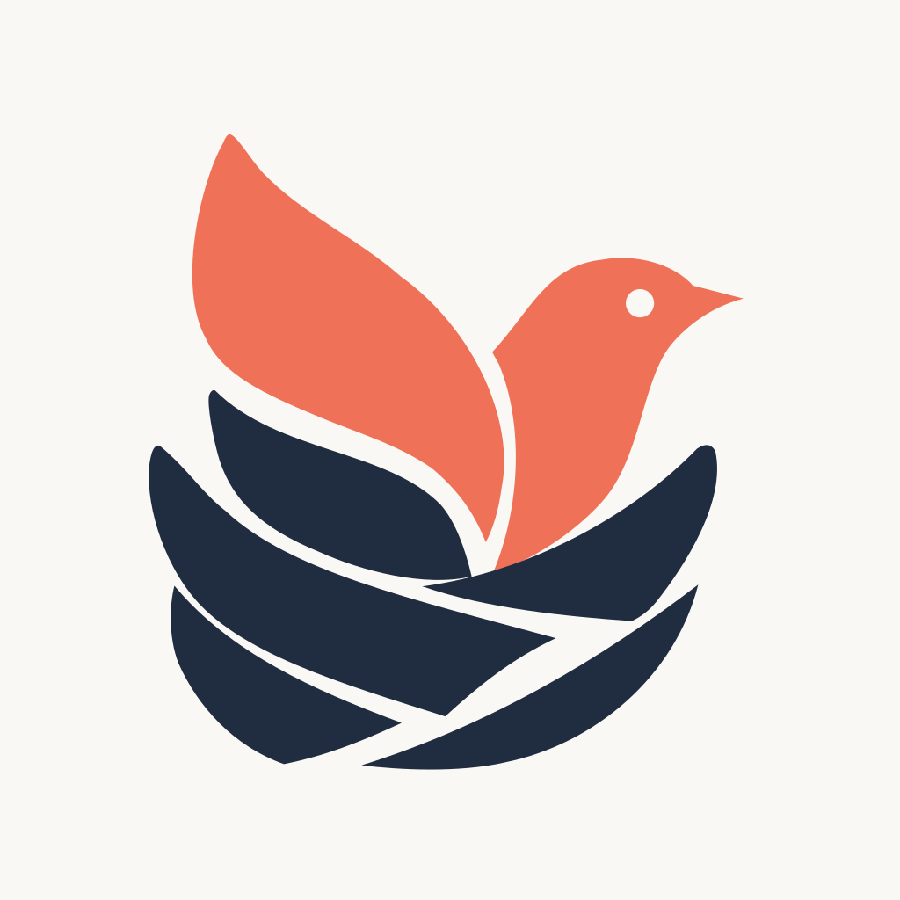

<div align="center">

<picture>
  <source media="(max-width: 600px) and (prefers-color-scheme: dark)" srcset="docs/assets/conest-banner-zh-mobile-dark.svg" />
  <source media="(max-width: 600px)" srcset="docs/assets/conest-banner-zh-mobile.svg" />
  <source media="(prefers-color-scheme: dark)" srcset="docs/assets/conest-banner-zh-dark.svg" />
  
</picture>

[English](README.md) &nbsp; / &nbsp; **简体中文**

[](https://github.com/zyw02/CoNest/actions/workflows/repository.yml) [](https://nodejs.org/) [](https://pnpm.io/) [](CONTRIBUTING-zh.md)

<br />

<a href="#快速开始"><strong>快速开始</strong></a> &nbsp;·&nbsp; <a href="bridge/STUDIO-zh.md"><strong>Studio</strong></a> &nbsp;·&nbsp; <a href="#分支与能力"><strong>分支与能力</strong></a> &nbsp;·&nbsp; <a href="CONTRIBUTING-zh.md"><strong>参与共建</strong></a> &nbsp;·&nbsp; <a href="https://github.com/zyw02/CoNest/issues"><strong>Issues</strong></a>

</div>

<br />

**CoNest 正在构建面向 Agent 的互联与协作基础设施。** 我们希望连接不同框架、不同运行环境中的 Agent，让工具、记忆、服务与工作流能够被发现、调用和组合，让各自独立的能力共同完成任务。

**当前实现：** 从 OpenClaw 与 DeepSeek Harness（DSH）的接入起步，以 Cordis 组件运行时提供能力组合、工具互用和共享记忆，Studio 展示接入能力与执行记录。更多 Agent 的接入和跨运行环境协作，是项目继续建设的方向。

> [!TIP]
> **探索 0.6.4** — Gateway 与 CoNest Host 双进程、办公组件组合，以及 `--core` 无 DSH 演示。
> [Windows 安装与演示 →](bridge/docs/windows-0.6.4-zh.md) · [版本范围 →](bridge/docs/release-0.6.4-zh.md)

## 让能力彼此相连

- **[连接 Agent](bridge/README.md)** — 面向不同框架和运行环境扩展接入。当前以 OpenClaw 与 DSH 验证执行接入和工具互用。

- **[组合工具与服务](bridge/README.md)** — 将能力组织成可复用组件，由运行时管理依赖、调用与生命周期，让服务彼此协作。

- **[让知识持续积累](bridge/STUDIO-zh.md)** — 通过共享知识图谱捕获和召回记忆，让不同任务接续已记录的知识、约定与经验。

- **[观察能力如何运行](bridge/STUDIO-zh.md)** — 在 Studio 查看工具与组件目录、执行结果和活动时间线。

<details>
<summary><strong>架构与当前边界</strong> · Gateway / Host / 可选 DSH</summary>

[目标架构](DESIGN-zh.md) 将 Cordis 对 OpenClaw 的增强扩展为不依赖 DSH 也能运行的模式。0.6.4 已采用 **Gateway 与 CoNest Host 两个常驻应用进程**，DSH Agent / Session 已迁入 Host；Management、Runtime 与可选 DSH 组合共享 Host。

办公服务示例演示可复用 Cordis 服务及单次调用的依赖图版本一致性。`--core` 可关闭 DSH；独立 Core / DSH 发行包、完整插件贡献模型仍为后续工作。

</details>

<a name="快速开始"></a>

## 快速开始

开发验证环境：**Linux x64、Node.js 24.15.0、pnpm 11.7.0**。系统需要 Git、tar；原生依赖从源码构建时需要 Python 3、make 和 C++ 编译器。Windows / Red Hat 8 的运行包验证范围见开发分支说明，不能将本地开发构建当作跨平台发行包。

```bash
# 使用开发主线参与共建；稳定基线可以把 develop 换成 main。
git clone --branch develop https://github.com/zyw02/CoNest.git
cd CoNest

# 下载并验证固定的 DSH SDK；无需原开发服务器。
node maintenance/bootstrap.mjs

# 安装锁定依赖、构建并运行测试。
pnpm --dir bridge install --frozen-lockfile
pnpm --dir bridge run build
pnpm --dir bridge exec tsx --test 'test/*.test.ts'
```

<details>
<summary>依赖与 SDK 下载说明</summary>

下载的是所需 DSH 源码、JavaScript 运行库和许可证，约 2.3 MB；不包含 Ubuntu 依赖、`node_modules`、会话或凭据。普通依赖来自 npm，SDK 和锁文件均固定版本。见 [依赖来源](maintenance/DEPENDENCIES-zh.md)。

</details>

完成构建后，用隔离状态目录运行四段 Studio 验收：

```bash
CONEST_DEMO_STATE=/absolute/disposable/conest-studio \
  pnpm --dir bridge exec node scripts/demo-studio.mjs --verify
```

当前集成固定使用 [OpenClaw 2026.9.2](https://www.npmjs.com/package/openclaw/v/2026.9.2)。默认采用**本地模型 fixture**：Gateway、DSH Loop、工具和持久化实际执行，不调用付费模型。真实模型接入和插件安装见 [Studio 手册](bridge/STUDIO-zh.md) 与 [插件说明](bridge/README.md)。

<a name="分支与能力"></a>

## 分支与能力

`main` 为稳定基线，`develop` 为开发线。两条分支均已接入 OpenClaw / DSH 与 Studio，并验证干净克隆后的依赖恢复和构建。下表只列实现差异；更多 Agent 与运行环境将随适配能力逐步扩展。

| 能力 | <a href="https://github.com/zyw02/CoNest/tree/main"><picture><source media="(prefers-color-scheme: dark)" srcset="docs/assets/readme/git-branch-dark.svg" /></picture> <code>main</code></a> · 0.6.2 | <a href="https://github.com/zyw02/CoNest/tree/develop"><picture><source media="(prefers-color-scheme: dark)" srcset="docs/assets/readme/git-branch-dark.svg" /></picture> <code>develop</code></a> · 0.6.4 |
| :--- | :--- | :--- |
| DSH 执行位置 | Gateway | CoNest Host |
| 无 DSH 模式 | — | `--core` 办公组件演示 |
| 共享记忆 | Gateway 内提供 | `dsh-memory` 组件 |
| 工作区搜索 | `knowledge_search` 与验证能力 | 另接入 `dsh_grep` / `dsh_glob` |
| 文本读取 | Gateway 内提供 | `dsh-read`，保留读后写校验 |
| DSH 动态组件 | 尚未接入 | Host 工具准入与组件 worker |

<sub>当前浏览的是 <strong>develop</strong>。<code>v0.6.2</code> 保留最初备份；分支维护与安装包发布独立进行。</sub>

## 从这里继续

- **使用 CoNest** · [插件配置](bridge/README.md) · [Studio 手册](bridge/STUDIO-zh.md)
- **参与开发** · [贡献指南](CONTRIBUTING-zh.md) · [依赖来源与复现](maintenance/DEPENDENCIES-zh.md)
- **理解实现** · [授权模型](bridge/AUTHORIZATION.md) · [源码来源](maintenance/IMPORT-zh.md)

<details>
<summary>仓库内容与历史交付资料</summary>

Git 中维护源码、测试、文档和构建配置。历史交付包、原始验收报告和个人运行数据不在仓库内；旧教程中的本地 `releases/`、`reports/` 链接需要对应交付资料。

</details>

<br />

---

<div align="center">



**一起构建 Agent 的互联世界。**

从一个组件、一条反馈或一次 PR 开始。

[参与共建 →](CONTRIBUTING-zh.md) &nbsp;·&nbsp; [反馈问题 →](https://github.com/zyw02/CoNest/issues)

<sub>Agents · Tools · Memory · Services &nbsp; / &nbsp; CoNest</sub>

</div>
