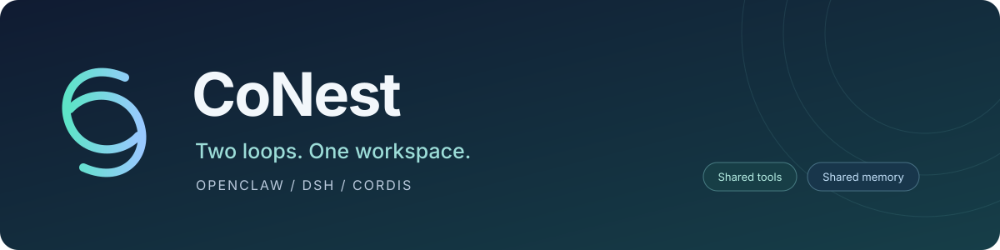

<div align="center">

**English** · [简体中文](README-zh.md)



**Two agent loops · Shared tools and memory · One component runtime**

[](https://github.com/zyw02/CoNest/actions/workflows/repository.yml)
[](https://www.npmjs.com/package/openclaw/v/2026.9.2)


[](CONTRIBUTING.md)

[Quick start](#quick-start) · [Branches](#branches) · [Contribute](CONTRIBUTING.md) · [Studio guide (中文)](bridge/STUDIO-zh.md) · [Issues](https://github.com/zyw02/CoNest/issues)

</div>

---

CoNest connects **OpenClaw** with **DeepSeek Harness (DSH)**. Choose an agent loop, use tools from both ecosystems, and share memory between tasks in one workspace. CoNest Runtime manages the underlying Cordis components; Studio provides the interface and execution history.

The [target architecture (中文)](DESIGN-zh.md) extends Cordis-based OpenClaw enhancement to work without DSH. Its default deployment uses two persistent application processes: Gateway and CoNest Host. In 0.6.4, Management, Runtime and the optional DSH composition share that Host. DSH is optional at runtime; separate Core/DSH distribution packages remain future work.

**0.6.4 demo:** [Windows installation and scenarios (中文)](bridge/docs/windows-0.6.4-zh.md) · [Release scope](bridge/docs/release-0.6.4-zh.md). The new office example demonstrates reusable Cordis services and per-call dependency graph consistency. Use `--core` to run the OpenClaw scenario without starting DSH.

<table>
<tr><td width="50%">

### ↔ Choose your execution loop

Switch between the native OpenClaw loop and DSH. Follow actual task results in Studio.

</td><td width="50%">

### ◈ Build with components

A dedicated worker manages component discovery, invocation, lifecycle and permissions. Configure capabilities through the runtime.

</td></tr>
<tr><td>

### ◎ Keep context across tasks

Share a knowledge graph with automatic memory capture and recall, so tasks can use recorded project decisions and preferences.

</td><td>

### ⌘ Work in one interface

Explore tool and ecosystem catalogs, switch loops, and follow the activity timeline. The companion DSH Web plugin displays the same Studio.

</td></tr>
</table>

## Quick start

Validated development environment: **Linux x64, Node.js 24.15.0 and pnpm 11.7.0**. Install Git and tar; native builds also require Python 3, make and a C++ compiler. Windows and RHEL 8 release packages have separate platform requirements and validation.

```bash
# Use develop to contribute; use main for the stable baseline.
git clone --branch develop https://github.com/zyw02/CoNest.git
cd CoNest

# Download and verify the pinned DSH SDK.
node maintenance/bootstrap.mjs

# Install locked dependencies, build and test.
pnpm --dir bridge install --frozen-lockfile
pnpm --dir bridge run build
pnpm --dir bridge exec tsx --test 'test/*.test.ts'
```

The SDK contains the required DSH source, JavaScript runtime, types and licenses, approximately 2.3 MB compressed. Ordinary dependencies come from npm. Both the SDK and package lockfile are pinned. See [dependency provenance (中文)](maintenance/DEPENDENCIES-zh.md).

After building, run the four Studio acceptance scenarios with a disposable state directory:

```bash
CONEST_DEMO_STATE=/absolute/disposable/conest-studio \
  pnpm --dir bridge exec node scripts/demo-studio.mjs --verify
```

The default uses a **local model fixture**: Gateway, loops, tools and persistence execute normally without paid model calls. See the [Studio guide (中文)](bridge/STUDIO-zh.md) and [plugin README](bridge/README.md) for installation and model configuration.

## Branches

| Capability | `main` · 0.6.2 stable baseline | `develop` · 0.6.4 development |
|---|---|---|
| OpenClaw / DSH loops and Studio | ✓ | ✓ |
| DSH Agent / Session | In Gateway | Inside CoNest Host |
| OpenClaw without DSH | — | Office component demo via `--core` |
| Shared memory | Runs in Gateway | Dedicated `dsh-memory` component |
| Component workspace search | `knowledge_search` and verification | Also serves `dsh_grep` and `dsh_glob` |
| Text reads | Run in Gateway | Dedicated `dsh-read`, with guarded-edit observations |
| Dynamic component access from DSH loop | Pending | Host tool admission and component worker connected |
| Clean-clone dependency recovery and builds | ✓ | ✓ |

You are viewing **develop**. The original `v0.6.2` tag preserves the initial backup; branch maintenance continues independently of packaged releases.

## Explore

| Goal | Start here |
|---|---|
| Change code, run checks and submit a PR | [Contributing](CONTRIBUTING.md) |
| Understand SDK verification and third-party licenses | [Dependencies (中文)](maintenance/DEPENDENCIES-zh.md) |
| Configure the plugin and components | [Plugin README](bridge/README.md) |
| Try both loops and shared memory | [Studio (中文)](bridge/STUDIO-zh.md) |
| Understand permissions and invocation boundaries | [Authorization](bridge/AUTHORIZATION.md) |
| Inspect the original source import | [Import provenance (中文)](maintenance/IMPORT-zh.md) |

Git contains source, tests, documentation and build configuration. Historical release packages, private acceptance reports and personal runtime data are distributed or retained separately. Old links into `releases/` and `reports/` require the corresponding delivery materials.

---

<div align="center">

**Build together, one capability at a time.**

Start on `develop` · Validate before merging into `main` · Tag releases

</div>
